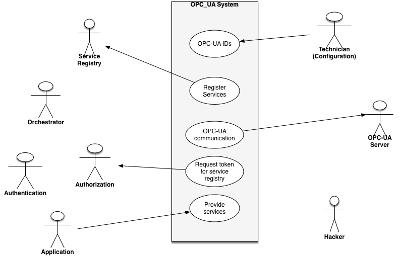
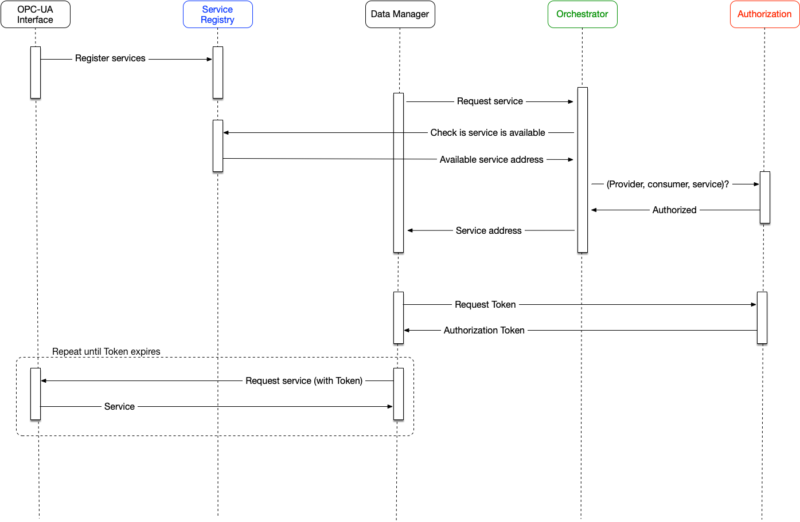

Arrowhead Framework OPC-UA service prosumer
=======
Prosumer Description
=======

This is a service prosumer compatible with the [Arrowhead Framework 4.x](https://github.com/arrowhead-f).

[1. Introduction](#introduction)  
[2. Services](#services)  
[2.1 Produced Services](#produced-services)  
[2.2 Consumed Services](#consumed-services)  
[3. Installation](#installation)  
[3.1 Configuration](#configuration)  
[3.2 Build](#build)  
[3.3 Run](#run)  
[3.4 Shutdown](#shutdown)  
[4. Use-cases](#use-cases)  
[5. Sequence diagrams](#sequence-diagrams)  

## Introduction
The Arrowhead Framework OPC-UA service prosumer is a (Java) program that allows other Arrowhead Prosumers to connect to OPC-UA endpoints (e.g. a PLC) and read variables from them. It can be seen as a wrapper that enables the OPC-UA device to offer services within a local cloud.

## Services
Being an Arrowhead Framework service prosumer, it produces and consumes services of other prosumers within its local cloud.

### Produced services
- [opcVariable](opcVariable.md)

### Consumed services
The prosumer consumes the necessary services of the core prosumers within its local cloud, such as:
- [Orchestration](https://github.com/arrowhead-f/core-java/tree/master/documentation/Orchestrator)

## Installation
This prosumer is a [Maven](http://maven.apache.org/) module. To build and run this prosumer, use the following steps.

### Configure
In the configuration file for the provider: */provider/config/default.conf* you will find the settings for this prosumer.  NOTE! For the example Consumer (found in the *tester* folder), there are no OPC-UA configurations available in its configuration file in the current implementation. The OPC-UA related variables for the tester can be found in */tester/src/main/java/eu/arrowhead/tester/OPC2RESTConsumer.java* and more specifically in the "consumeService" method.

### Build
Build the module using [Maven](http://maven.apache.org/).

### Run
To **start** the service prosumer, run: `java -jar provider-4.0.jar -auth` in the *target* folder after building the Maven module. 
The `-auth` flag is optional and only adds the example Consumer found in the "tester" folder to the IntraCloud authorization so that it is allowed to consume the service.

### Shutdown
To **stop** the prosumer, type `stop` in the Terminal window in which it was started.

## Use cases

## Sequence diagrams

